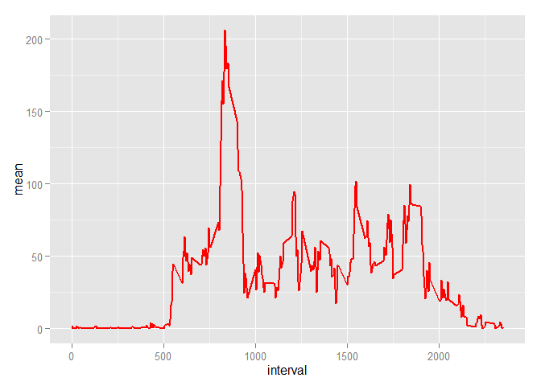
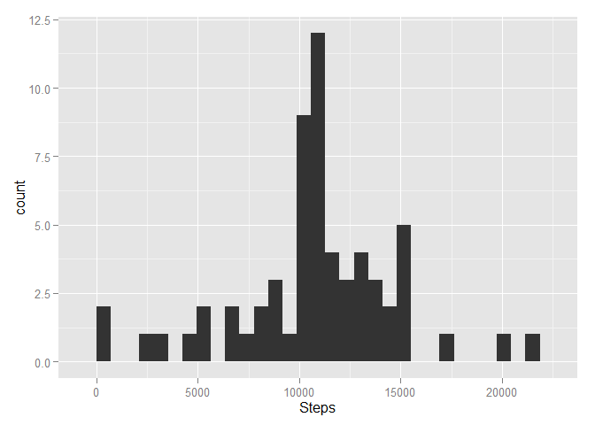

# Reproducible Research: Peer Assessment 1
This report require the `ggplot2` and the `lattice` packages for plotting graphs.

```r
options(scipen=1, digits=2)
require('ggplot2')
require('lattice')
```

## Loading and preprocessing the data
### 1. Load the data
The code below will unzip the raw data and save it into a variable called `raw_data`.


```r
raw_data <- read.csv(unzip('activity.zip'))
```

###2. Process/transform the data (if necessary) into a format suitable for your analysis
Dates will be converted into their proper class later.


## What is mean total number of steps taken per day?
###1. Calculate the total number of steps taken per day.

```r
daily_steps <- tapply(raw_data$steps, raw_data$date, sum, na.rm = TRUE)
daily_steps
```

```
## 2012-10-01 2012-10-02 2012-10-03 2012-10-04 2012-10-05 2012-10-06 
##          0        126      11352      12116      13294      15420 
## 2012-10-07 2012-10-08 2012-10-09 2012-10-10 2012-10-11 2012-10-12 
##      11015          0      12811       9900      10304      17382 
## 2012-10-13 2012-10-14 2012-10-15 2012-10-16 2012-10-17 2012-10-18 
##      12426      15098      10139      15084      13452      10056 
## 2012-10-19 2012-10-20 2012-10-21 2012-10-22 2012-10-23 2012-10-24 
##      11829      10395       8821      13460       8918       8355 
## 2012-10-25 2012-10-26 2012-10-27 2012-10-28 2012-10-29 2012-10-30 
##       2492       6778      10119      11458       5018       9819 
## 2012-10-31 2012-11-01 2012-11-02 2012-11-03 2012-11-04 2012-11-05 
##      15414          0      10600      10571          0      10439 
## 2012-11-06 2012-11-07 2012-11-08 2012-11-09 2012-11-10 2012-11-11 
##       8334      12883       3219          0          0      12608 
## 2012-11-12 2012-11-13 2012-11-14 2012-11-15 2012-11-16 2012-11-17 
##      10765       7336          0         41       5441      14339 
## 2012-11-18 2012-11-19 2012-11-20 2012-11-21 2012-11-22 2012-11-23 
##      15110       8841       4472      12787      20427      21194 
## 2012-11-24 2012-11-25 2012-11-26 2012-11-27 2012-11-28 2012-11-29 
##      14478      11834      11162      13646      10183       7047 
## 2012-11-30 
##          0
```

###2. Make a histogram of the total number of steps taken each day.

```r
qplot(daily_steps,xlab = "Steps")
```

 

###3. Calculate and report the mean and median of the total number of steps taken per day

a. Mean number of steps: `mean(daily_steps)`

    9354.23

b. Median number of steps: `median(daily_steps)`

    10395 


## What is the average daily activity pattern?
###1. Make a time series plot of the 5-minute interval (x-axis) and the average number of steps taken, averaged across all days (y-axis)

```r
average_steps <- aggregate(raw_data$steps, list(raw_data$interval), mean, na.rm = TRUE)
names(average_steps) = c("interval", "mean")
ggplot(average_steps, aes(x = interval, y = mean)) + geom_line(size=1,color="red")
```

 

###2. Which 5-minute interval, on average across all the days in the dataset, contains the maximum number of steps?
The interval with the maximum mumber of steps on average is 835.

```r
average_steps[which.max(average_steps$mean),]$interval
```

```
## [1] 835
```


## Imputing missing values
###1. Calculate and report the total number of missing values in the dataset (i.e. the total number of rows with NAs)
Number of missing values: 2304.

```r
sum(is.na(raw_data$steps))
```

```
## [1] 2304
```

###2. Devise a strategy for filling in all of the missing values in the dataset. The strategy does not need to be sophisticated. For example, you could use the mean/median for that day, or the mean for that 5-minute interval, etc.
My strategy is to fill in the missing values with the average value from the same interval.

###3. Create a new dataset that is equal to the original dataset but with the missing data filled in.

```r
modified_data <- raw_data 
for (x in 1:nrow(modified_data)) {
    if (is.na(modified_data$steps[x])) {
        modified_data$steps[x] <- average_steps$mean[average_steps$interval == modified_data$interval[x]]
    }    
}
```

Original Dataset         | New Dataset
------------------------ | ---------------------
**Dimensions**           | **Dimensions**
`dim(raw_data)`          | `dim(modified_data)`
17568, 3        | 17568, 3
**Number of NAs**        | **Number of NAs**
`sum(is.na(raw_data))`   | `sum(is.na(modified_data))`
2304 | 0


###4. Make a histogram of the total number of steps taken each day and calculate and report the mean and median total number of steps taken per day. Do these values differ from the estimates from the first part of the assignment? What is the impact of imputing missing data on the estimates of the total daily number of steps?

```r
modified_daily_steps <- aggregate(modified_data$steps, list(modified_data$date), sum)
names(modified_daily_steps) = c("interval","total_steps_daily")
qplot(modified_daily_steps$total_steps_daily, xlab = "Steps")
```

 

Mean                                              | Median
--------------------------------------------------| ------
10766.19  | 10766.19

The above values differ from the estimates from the first part of the assignment. Imputing missing data seems to normalize the data around its mean. 
We can also see that the outliers for the later histrogram are less extreme and it has a more bell-shaped distribution as compared to the raw data's histrogram.


## Are there differences in activity patterns between weekdays and weekends?
###1. Create a new factor variable in the dataset with two levels - "weekday" and "weekend" indicating whether a given date is a weekday or weekend day.


```r
modified_data$day <- weekdays(as.Date(modified_data$date))
weekdays <- c('Monday','Tuesday','Wednesday','Thursday','Friday')
modified_data$weekDayorEnd <- factor(modified_data$day %in% weekdays,
                                     levels=c(FALSE,TRUE), labels=c('Weekend','Weekday'))

weekDayorEnd_steps <- aggregate(modified_data$steps, list(modified_data$interval, modified_data$weekDayorEnd), mean)
names(weekDayorEnd_steps) = c("time", "weekDayorEnd", "mean")
```

###2. Make a panel plot containing a time series plot (i.e. type = "l") of the 5-minute interval (x-axis) and the average number of steps taken, averaged across all weekday days or weekend days (y-axis).

```r
xyplot(mean ~ time | weekDayorEnd, weekDayorEnd_steps, layout = c(1, 2), type = "l")
```

 
